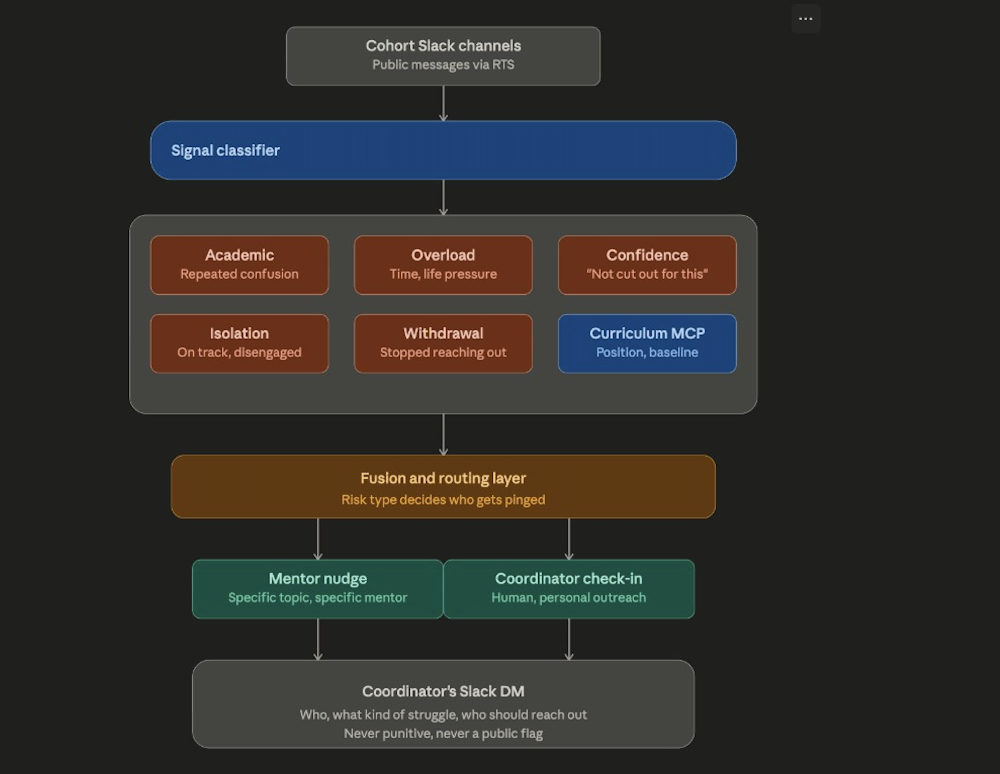
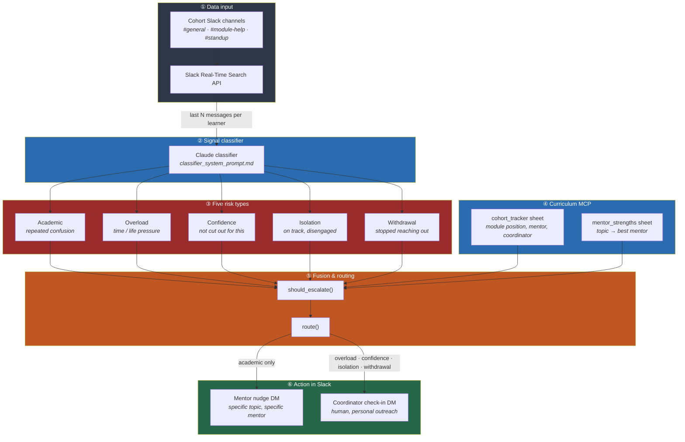
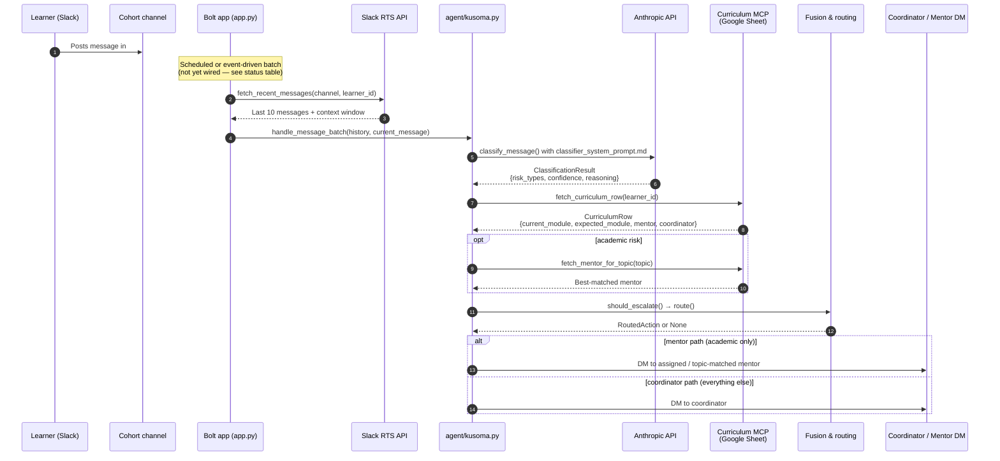
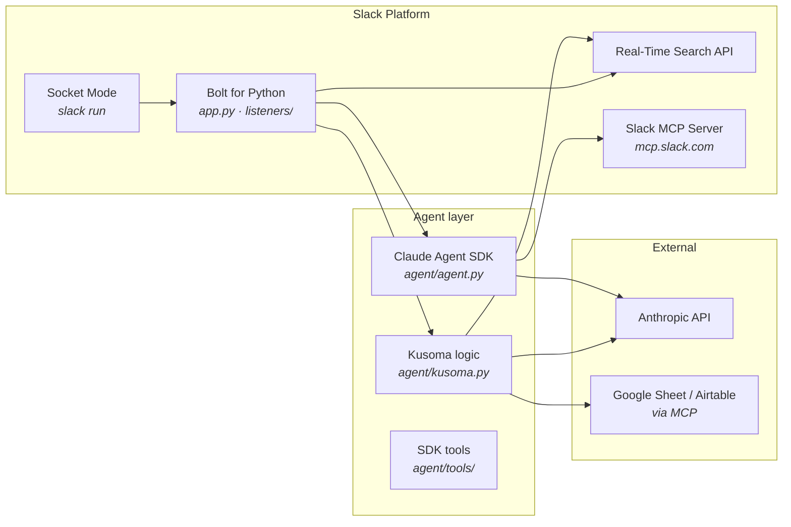

# Kusoma

*Kusoma* means **to study** in Swahili — fitting for a tool that watches how learners are doing, not just whether they passed.

**Catching the quiet signs of struggle in scholarship and training cohorts — before a dropout, not after.**

By the time a learner formally fails or vanishes from a program, they've usually checked out weeks earlier — informally, in plain sight, inside the cohort's own Slack. Kusoma reads that signal continuously: who's stuck on the same concept repeatedly, who's quietly gone silent against their own baseline, who's showing overload language unrelated to coursework, who's lost confidence rather than knowledge, who's isolated despite being on track. It fuses that with where each learner actually stands in the curriculum (via MCP into a shared tracking sheet), and sends one clear, specific, non-punitive nudge to a coordinator or mentor: **who**, **what kind of struggle**, **what to do about it** — early enough to actually help.

---

## Table of contents

1. [Why this wins](#why-this-wins)
2. [Architecture at a glance](#architecture-at-a-glance)
3. [How data flows end-to-end](#how-data-flows-end-to-end)
4. [Technologies and where they connect](#technologies-and-where-they-connect)
5. [Demo scenarios](#demo-scenarios-touch-points)
6. [What's built vs what's left](#whats-built-vs-whats-left)
7. [Project structure](#project-structure)
8. [Run locally](#run-locally)
9. [Demo script](#demo-script-3-minutes)
10. [Further reading](#further-reading)

---

## Why this wins

| Judging lens | How Kusoma addresses it |
|---|---|
| **Quality of idea** | Dropout research splits causes into demographic, course-related, technology, motivational, and support factors. LMS dashboards and generic engagement bots detect at most one branch. Kusoma's **five-signal taxonomy** (academic, overload, confidence, isolation, withdrawal) is the differentiator. |
| **Potential impact** | Scholarship and training programs lose learners — and funders lose confidence — for reasons visible in chat logs **weeks** before any formal record shows it. |
| **Technological implementation** | Uses two required technologies **meaningfully**: **RTS** for in-workspace pattern detection, **MCP** for external curriculum tracking — not bolted on superficially. |
| **Design** | One calm Slack DM to a coordinator. Never punitive. Never a public flag. Restraint is the right UX for privacy-sensitive subject matter. |

---

## Architecture at a glance





**Design principle:** output always goes to a **human** (mentor or coordinator). The learner is never publicly flagged. The system recommends; humans decide.

---

## How data flows end-to-end

This is the full path from a learner posting in `#module-help` to a coordinator receiving a DM.



### Step-by-step (plain language)

| Step | What happens | Code / doc |
|---|---|---|
| **1. Pick up chats** | App queries cohort public channels via **Slack RTS** for a rolling window of messages per learner (not just the latest line — withdrawal and isolation need history). | `fetch_recent_messages()` in `agent/kusoma.py` — **stub** |
| **2. Classify** | Messages + history sent to Claude with a strict JSON-returning system prompt. Output: one or more of five risk types, confidence, reasoning. | `classify_message()` + `docs/classifier_system_prompt.md` — **logic ready, needs live wiring** |
| **3. Curriculum lookup** | Given `learner_id`, read their row from the MCP-connected sheet: module position, assigned mentor, coordinator. | `fetch_curriculum_row()` — **stub**; schema in `docs/curriculum_mcp_schema.md` |
| **4. Fuse** | Gate: don't escalate noise (e.g. Felix joking, low-confidence academic while on track). Combine classifier output with curriculum standing. | `should_escalate()` — **done, tested** |
| **5. Route** | Academic → topic-matched **mentor**. Overload / confidence / isolation / withdrawal → **coordinator**. Multiple flags → one combined coordinator message. | `route()` — **done, tested** |
| **6. Act in Slack** | Send a single private DM. Format: who, what struggle, suggested action. Never punitive. | **not wired** — needs Bolt `chat.postMessage` to mentor/coordinator |

---

## Technologies and where they connect



| Technology | Role in Kusoma | Current state |
|---|---|---|
| **Bolt for Python** | App entry point, event listeners, Socket Mode connection to sandbox workspace | Scaffold running via `slack run` |
| **Claude Agent SDK** | Conversational agent layer (`agent/agent.py`) — emoji reactions, Slack MCP tools | Template agent active; not yet the Kusoma pipeline |
| **Anthropic API** | Powers `classify_message()` — prompt-based classifier, not custom ML | Logic written; `ANTHROPIC_API_KEY` in `.env` |
| **Slack RTS** | Reads public cohort channel messages for pattern detection across time | Interface stubbed in `fetch_recent_messages()` |
| **Curriculum MCP** | Read-only access to `cohort_tracker` + `mentor_strengths` sheets | Interface stubbed; schema documented |
| **Slack MCP Server** | Optional: search channels, read history, send messages from the SDK agent | Available when user OAuth token present |

### Two agent layers (important)

The scaffold ships with **two separate modules** that will merge:

| Module | Purpose | Status |
|---|---|---|
| `agent/agent.py` | Slack's Claude Agent SDK — handles DMs, @mentions, assistant panel | Working (template "friendly assistant") |
| `agent/kusoma.py` | Kusoma pipeline — classify → fuse → route | Core logic complete, not connected to Bolt listeners yet |

The hackathon integration work is wiring `agent/kusoma.py` into a Bolt listener (likely a scheduled job or channel message event) and replacing the template system prompt in `agent/agent.py` when appropriate.

---

## Demo scenarios (touch points)

Six seeded personas in `docs/seed_cohort_data.md`. Each exercises exactly one risk path (plus Felix as a no-signal control).

| Persona | Risk type | Curriculum | Expected route | Demo moment |
|---|---|---|---|---|
| **Felix** | *(none)* | On track (4/4) | No action | "System stays quiet on normal venting" |
| **Aida** | Academic | Behind (2/4) | Mentor **Sam** (closures) | Repeated confusion + behind on sheet |
| **Brian** | Overload | Slightly behind (3/4) | Coordinator **Jane** | Life pressure, not content confusion |
| **Carmen** | Confidence | On track (4/4) | Coordinator **Jane** | Self-doubt despite being on track |
| **Daniel** | Isolation | On track (4/4) | Coordinator **Jane** | Submitting but socially disengaged |
| **Esther** | Withdrawal | Behind + stale (2/4) | Coordinator **Jane** | Was active, now silent vs own baseline |

### What each demo path proves

```
Felix  →  classifier discriminates (no false positives)
Aida   →  academic + curriculum lag → mentor, not coordinator
Brian  →  overload ≠ academic (different routing)
Carmen →  confidence independent of module position
Daniel →  isolation fires even when on track (the counterintuitive case)
Esther →  withdrawal needs history, not a single message
```

### Coordinator DM format (target output)

Every routed action ends as **one private message** like:

> **Aida K.** has asked about **closures** more than once and is currently on module **2** vs an expected **4**. You've helped others with this before — might be worth a quick check-in.
>
> → Route to: **@sam** (mentor)

or

> **Carmen R.** has expressed self-doubt comparing themselves to peers. Worth noting: they're actually **on track** (4/4) — this looks like a confidence gap, not a skills gap.
>
> → Route to: **@jane** (coordinator)

---

## What's built vs what's left

### Built and tested

| Component | Location | Verification |
|---|---|---|
| Classifier system prompt (5 risk types) | `docs/classifier_system_prompt.md` | Manual trace in `docs/manual_classification_trace.md` |
| Fusion gate logic | `agent/kusoma.py` → `should_escalate()` | 13 pytest cases pass |
| Routing logic (mentor vs coordinator) | `agent/kusoma.py` → `route()` | All 6 personas covered in `tests/test_kusoma_routing.py` |
| Cohort pattern check | `agent/kusoma.py` → `check_cohort_pattern()` | Tested (2+ learners same topic → group session suggestion) |
| Seed persona data | `docs/seed_cohort_data.md` | 6 personas with expected outcomes |
| Curriculum MCP schema | `docs/curriculum_mcp_schema.md` | Sample rows for all personas |
| End-to-end traces | `docs/end_to_end_trace.md` | Aida + Daniel walked through |
| Bolt scaffold + Socket Mode | `app.py`, `.slack/`, `manifest.json` | `slack run` connects to sandbox |
| Scaffold tests | `tests/` | 18/18 passing |

### Stubbed (interface defined, not wired)

| Component | Function | Next step |
|---|---|---|
| **RTS message fetch** | `fetch_recent_messages()` | Call Slack RTS API scoped to `#general`, `#module-help`, `#standup`; return last N messages per learner |
| **Curriculum MCP read** | `fetch_curriculum_row()` | Connect Google Sheet MCP; map row → `CurriculumRow` |
| **Mentor topic lookup** | `fetch_mentor_for_topic()` | Read `mentor_strengths` sheet; sort by `times_successfully_explained` |
| **Pipeline orchestration** | `handle_message_batch()` | Called from a Bolt listener once steps above are wired |
| **Slack DM output** | *(not yet a function)* | `chat.postMessage` to mentor or coordinator user ID from curriculum row |

### Not started

| Task | Notes |
|---|---|
| Seed fake Slack workspace | Create channels, post scripted persona messages across 3 "weeks" |
| Bolt listener for ambient monitoring | Currently responds only to DMs and @mentions — needs channel-level or scheduled batch trigger |
| Live classifier smoke test | Script calling `classify_message()` with real API key against Aida + Carmen |
| Google Sheet + MCP server setup | Stand up `cohort_tracker` and `mentor_strengths` per schema |
| Demo recording | 3-minute video showing 2–3 personas firing different paths |

---

## Project structure

```
kusoma/
├── app.py                      # Bolt entry point (Socket Mode)
├── manifest.json               # Slack app config
├── .env                        # SLACK_BOT_TOKEN, SLACK_APP_TOKEN, ANTHROPIC_API_KEY
│
├── agent/
│   ├── agent.py                # Claude Agent SDK agent (template — conversational)
│   ├── kusoma.py               # Kusoma core: classify → fuse → route
│   ├── deps.py                 # Runtime deps (Slack client, channel, thread)
│   └── tools/                  # SDK tools (emoji reaction template)
│
├── listeners/
│   ├── events/                 # message.py, app_mentioned.py, app_home_opened.py
│   ├── actions/                # feedback buttons
│   └── views/                  # Block Kit builders
│
├── docs/                       # Design docs + runtime prompt
│   ├── architecture-pipeline.png
│   ├── classifier_system_prompt.md   ← loaded at runtime by kusoma.py
│   ├── curriculum_mcp_schema.md
│   ├── fusion_routing_logic.md
│   ├── seed_cohort_data.md
│   ├── end_to_end_trace.md
│   └── manual_classification_trace.md
│
├── tests/
│   ├── test_kusoma_routing.py  # 13 routing tests (no API needed)
│   ├── test_app_home_opened.py
│   └── test_view_builders.py
│
└── thread_context/             # Session store for conversational agent
```

---

## Run locally

### Prerequisites

- Slack Developer Program sandbox workspace
- `slack login` completed
- Python 3.12+

### Setup

```sh
cd kusoma
python3 -m venv .venv
source .venv/bin/activate
pip install -r requirements.txt
```

Add to `.env`:

```sh
SLACK_BOT_TOKEN=xoxb-...
SLACK_APP_TOKEN=xapp-...
ANTHROPIC_API_KEY=sk-ant-...
```

### Start the app

```sh
slack run
```

### Run tests (no Slack or API needed for routing)

```sh
pytest tests/ -v
```

Expected: **18 passed** (13 Kusoma routing + 5 scaffold).

---

## Demo script (3 minutes)

| Time | Show | Say |
|---|---|---|
| 0:00 | Architecture diagram (`docs/architecture-pipeline.png`) | "Learners struggle in Slack weeks before any formal record. Kusoma reads that signal." |
| 0:30 | Seed data — post as Aida in `#module-help` | "Aida asks about closures twice, is behind on the curriculum sheet." |
| 1:00 | Classifier output (JSON) | "Classifier returns academic, high confidence — not a generic flag." |
| 1:30 | Routing result | "Fusion sees she's behind → routes to Sam, the mentor who's helped with closures before." |
| 2:00 | Switch persona — Carmen or Daniel | "Different risk type, different route. Carmen's on track but losing confidence → coordinator, not mentor." |
| 2:30 | Coordinator DM | "One calm message. Who, what struggle, what to do. Never public. Never punitive." |
| 3:00 | Felix (no signal) | "And when there's nothing to act on, the system stays quiet." |

---

## Further reading

| Doc | Contents |
|---|---|
| [`docs/classifier_system_prompt.md`](docs/classifier_system_prompt.md) | Full classifier prompt — five risk types, baseline rules, JSON output schema |
| [`docs/seed_cohort_data.md`](docs/seed_cohort_data.md) | Six persona message histories for demo seeding |
| [`docs/fusion_routing_logic.md`](docs/fusion_routing_logic.md) | Gate rules, mentor vs coordinator paths, multi-flag merging |
| [`docs/curriculum_mcp_schema.md`](docs/curriculum_mcp_schema.md) | Google Sheet columns, sample rows, MCP read pattern |
| [`docs/end_to_end_trace.md`](docs/end_to_end_trace.md) | Full Aida + Daniel walkthroughs |
| [`docs/manual_classification_trace.md`](docs/manual_classification_trace.md) | Hand-verified classifier discrimination per persona |

---

## License

See [LICENSE](LICENSE).
